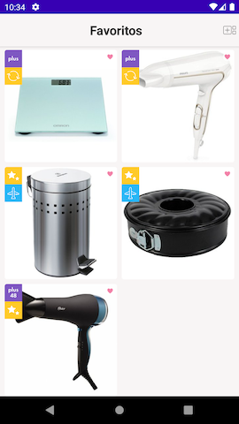
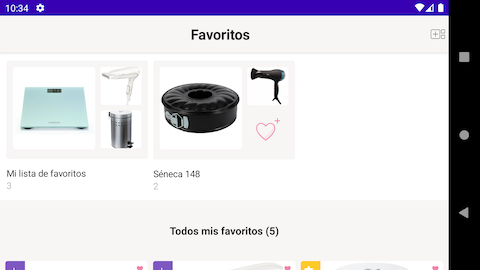
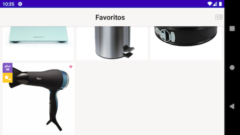

# Linio Technical Test
hello all! 👋 
this is my submission for the test

### instructions
```
This is the coding test, as part of the interviewing process for an Android position at Linio.
 
Assets:
·         The screen layout can be found at https://zpl.io/bJEk4Ea  
·         The assets can be found at https://zpl.io/a8Eqq6b  
·         The .json file can be loaded from https://gist.githubusercontent.com/aletomm90/7ff8e9a7c49aefd06a154fe097028d27/raw/c87e2e7d21313391d412420b4254c391aa68eeec/favorites.json
 
Please load the json on runtime
 
Description:
·         The screen is composed of a header with the screen name (Favoritos) and two different sections.
·         The first section displays a snapshot of each collection created by the user. Each snapshot should display the images for the 3 first products from each collection, the collection name and the quantity of items in that collection.
·         The second section must display all products, from all collections.
·         Each cell, in this section, should display the product image and the badges representing the product attributes:
                  o   Linio Plus badge if product is Linio Plus Level 1 (nd_ic_plus_30 icon image)
                  o   Linio Plus 48 if product is Linio Plus Level 2 (nd_ic_plus48_30 icon image)
o   Refurbished if product’s condition type is refurbished (nd_ic_refurbished_30 icon image)
o   New if product’s condition type is new (nd_ic_new_30 icon image)
o   Airplane if product is imported (nd_ic_international_30 icon image)
o   Free shipping truck if product has free shipping (nd_ic_free_shipping_30 icon image)
 
You don't have to create the navigation bar at the bottom. The objective is to create the favorites screen using data from a remote .json file.
 
Rules:
The code must be written in kotlin and the app must be compatible with Android 5.0+.
We will evaluate UI/design, code quality and project organization (MVVM is expected).
You must post your solution to your personal github account and share it with us.
The .json file must be loaded at runtime (use of Retrofit library is expected).
```

### development notes and findings
```
- some api values seem important but were ignored as they weren't in the instructions
	- collection.owner
	- collection.products.{hash}.active
- there is no navigation
- the domain layer is very thin and "middle-man-y" because there is no validation or 
  any custom behavior needed
- domain and data separation-of-concern was mantained by implementation of a tiny amount 
  of throttling in the data layer so we can provide entities independently or concurrently 
  without overusing the data source (server api)
- network implementation using Retrofit, Okhttp and Moshi for deserialization
- mock data served using an interceptor in OkHttp client
- dependency injection provided by Dagger Hilt
- clean architecture implemented using kotlin coroutines and Flow
- Unit tests in all layers
- mocking by Mockk
- UI built in Jetpack Compose (as an experiment o:)
- UI built using Material Components
- image loading with Coil
- UI test using compose-test

- Jetpack Compose is still pretty new, i had several issues with dependencies and conflicting
  versions, also current grid support doesn't allow to specify column spans for items so i had
  to revert to a custom lazy column implementation in the end.
- The items in the grid measure themselves horizontally to represent 2 columns (3 for landscape)
  and then vertically for a 1:1 aspect ratio, with proper padding and separators.
- After the rough starting configuration issues Compose was amazing, it works very very well with
  Clean Architecture.
- Added handling of border cases where odd number of items caused wrong sizes of product cards.
- Other than that the app doesn't do anything, there isn't any click listeners anywhere so it just
  shows the data from the mock json file.
```

### screenshots
#### loading

#### 6 items


#### 5 items




#### 4 items

